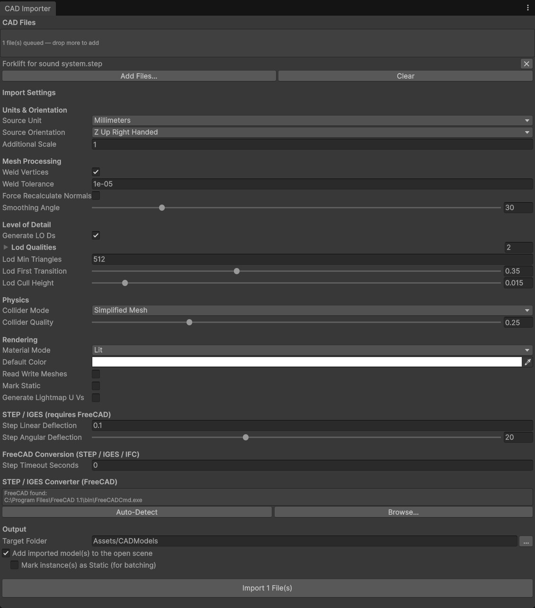
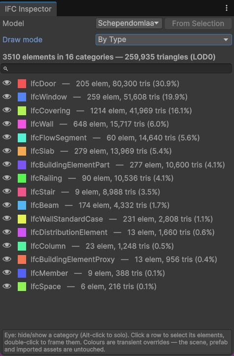

# CAD Importer for Unity

An editor + runtime toolkit for bringing CAD models into Unity, built for robotics
simulation and digital twins. Pure C# — no native plugins.

## Installation

**Via git URL** (Unity 6000.0+): open `Window → Package Manager`, press `+` →
*Add package from git URL…* and paste:

```
https://github.com/Motawe3/CADImporter.git?path=Packages/com.motawea.cad-importer
```

Pin a release by appending a tag: `…com.motawea.cad-importer#v1.0.0`

Or add it to `Packages/manifest.json` directly:

```json
"com.motawea.cad-importer": "https://github.com/Motawe3/CADImporter.git?path=Packages/com.motawea.cad-importer#v1.0.0"
```

## What it does

| Format | Editor import | Runtime import | Notes |
|--------|--------------|----------------|-------|
| STL (binary + ASCII) | ✔ drag & drop | ✔ | Multi-solid ASCII files become separate parts |
| PLY (ascii / binary LE / binary BE) | ✔ drag & drop | ✔ | Vertex colors and UVs preserved |
| OBJ | Unity native importer | ✔ | Runtime path supports groups, materials, negative indices |
| glTF 2.0 / GLB | ✔ drag & drop | ✔ | Node hierarchy **with pivots preserved** (robot rigs / joints), metallic-roughness PBR + textures, embedded/external/base64 buffers. No Draco/meshopt/KTX2 |
| STEP / IGES | ✔ via FreeCAD | – | Assembly **hierarchy with pivots preserved** (sub-assemblies / joints), parts and labels; requires [FreeCAD](https://www.freecad.org) |
| IFC / IFCZIP (BIM) | ✔ via FreeCAD | – | Spatial **hierarchy with pivots preserved** (site / building / storey / element), **BIM data on every element** (`IfcElement` component: IFC type, GlobalId, property sets), authored surface colours or a professional **colour-by-category** palette (incl. IFC4.3 infrastructure), georeferenced models moved to the origin with the offset recorded, optional space import; requires [FreeCAD](https://www.freecad.org) (bundles IfcOpenShell) |

## Quick start

1. **Drag & drop**: drop an `.stl` or `.ply` file anywhere under `Assets/`. It imports as a
   prefab with LODs, colliders and materials. Select the asset to tweak import settings.
2. **Batch import**: `Tools → CAD Importer` — queue external files, tune settings once,
   import into a target folder, optionally place instances in the open scene. The window
   shows only the settings the queued formats actually use.

   

3. **STEP/IGES/IFC**: install FreeCAD (free). The importer auto-detects `FreeCADCmd.exe`; if
   it doesn't, set the path in `Tools → CAD Importer`. STEP/IGES parts and IFC building
   elements each become a named child GameObject, nested by assembly / spatial structure.
   Compressed `.ifczip` archives import like plain `.ifc`.
4. **Runtime (digital twins)** — import the **CAD Importer Demo** sample from the Package
   Manager (requires URP) for a ready-made scene, or just add the `DemoCadRuntimeImporter`
   component to any GameObject and press Play:

```csharp
using CADImporter;

// async: parsing + geometry processing run off the main thread
GameObject robot = await CADRuntimeImporter.ImportAsync(
    @"C:\twins\gripper.stl",
    new CADRuntimeImportSettings
    {
        sourceUnit = SourceUnit.Millimeters,
        generateColliders = true,
        colliderQuality = 0.25f,
        convexColliders = true // needed on dynamic rigidbodies
    });
```

## IFC Inspector window — visual & statistical BIM inspection

`Tools → CAD Importer IFC Inspector` recolours an imported model in the scene by its BIM data
and breaks it down statistically, using the `IfcElement` components the importer attaches
(IFC type, GlobalId, property sets).



**Using it:**

1. Import an IFC and put an instance in the open scene (the batch window's *Add imported
   model(s) to the open scene* does this for you).
2. Open `Tools → CAD Importer IFC Inspector`. With one model in the scene it is picked
   automatically; otherwise choose it from the **Model** dropdown or select any part of it
   in the Hierarchy and press **From Selection**.
3. Pick a **Draw mode**:
   - **By Type** — one colour per IFC entity type (walls, slabs, windows, MEP…).
   - **By Storey** — one colour per building storey the element belongs to.
   - **By Load-bearing** / **By External** — classified from the imported property sets
     (`*.LoadBearing`, `*.IsExternal`): structural vs non-structural, envelope vs interior.
   - **Original** — restores the imported materials.
4. Read the **legend**: each row shows the category's colour swatch, element count, LOD0
   triangle count and its share of the model — the fastest way to answer "what is eating my
   triangle budget".
5. Work the legend:
   - **Eye icon** hides/shows a category in the Scene view (**Alt-click to solo** it);
     **Show All** brings everything back. Hiding a few large categories is the quickest way
     to look inside a building.
   - **Hiding is cumulative across draw modes.** Hide a storey, switch to *By Type* and hide
     doors, and both rules apply — an element is hidden when any category hides it. Un-hiding
     doors leaves the hidden storey's doors hidden, because the storey still hides them. A
     **dimmed eye** marks a category another mode partly hides, with an `n/total hidden`
     count; **Show All** counts every hidden element whatever mode you are in, and *Original*
     clears the colours and every hide rule at once.
   - **Click** a row to select its elements in the Hierarchy; **double-click** to frame them
     in the Scene view.
   - The **search field** filters the legend on models with many categories.

Everything the window does is transient editor state — colours are `MaterialPropertyBlock`
overrides and visibility uses the editor's scene-visibility system, so the scene, prefab and
imported assets are never modified. Closing the window (or picking *Original*) restores the
model exactly.

## Pipeline & performance decisions

- **Multi-core processing** — the CPU-heavy import stages (welding, normal generation,
  LOD/collision decimation, per-part STL parsing for STEP/IFC) fan out across all cores;
  only the final Unity mesh/prefab construction runs on the main thread. Large multi-part
  assemblies import several times faster on typical workstations. The runtime
  `ImportAsync` keeps all of this off the main thread, including collider decimation.
- **Unit conversion** — CAD files are usually millimeters; everything is scaled to meters
  (PhysX and Unity lighting assume meters — critical for correct physics in robotics).
- **Axis conversion** — CAD is Z-up right-handed; converted to Unity's Y-up left-handed
  with the triangle winding flipped so normals stay outward.
- **Vertex welding** — STL is triangle soup (3 unique vertices per triangle). Welding
  typically cuts vertex count ~6×, enables smooth shading, and is required for decimation.
- **Smooth normals with hard edges** — angle-weighted normals, split at a configurable
  smoothing angle (default 30°), so machined edges stay crisp.
- **LOD generation** — quadric-error-metric decimation builds a LODGroup per part
  (default 50% / 15% triangle ratios), running on position-welded topology so hard edges
  never tear open. Essential when a factory scene contains dozens of high-poly assemblies.
- **Simplified collision meshes** — physics meshes are decimated separately (default 25%).
  Mesh-collider cost dominates robotics simulation; never collide against render meshes.
  Use `ConvexMesh` mode for parts that move under a dynamic `Rigidbody` (robot links).
- **Index buffers** — 16-bit whenever a part is under 65k vertices; mesh data is uploaded
  and marked non-readable (halves CPU-side memory) unless you opt out.
- **Shared materials** — one default URP Lit material for uncolored parts keeps
  SRP-batcher/batching effective.

## Import settings reference

| Setting | Default | Why |
|---------|---------|-----|
| Source unit | mm | CAD convention |
| Orientation | Z-up right-handed | CAD convention |
| Weld tolerance | 1e-5 m | merge coincident verts without eating detail |
| Smoothing angle | 30° | hard machined edges stay hard |
| LOD qualities | 0.5, 0.15 | 3-level chain |
| Collider mode | Simplified mesh | best accuracy/perf trade-off |
| Collider quality | 0.25 | physics rarely needs render detail |
| Mark static | off | robot links move; enable for factory shells |

## Package layout

```
com.motawea.cad-importer/
├── Runtime/            asmdef: CADImporter.Runtime (usable in builds)
│   ├── Core/           intermediate model, processing, decimator, mesh builder
│   ├── Parsers/        StlParser, PlyParser, ObjParser
│   ├── Shaders/        vertex-color visualization shader
│   ├── Demo/           DemoCadRuntimeImporter sample component
│   ├── CADRuntimeImporter.cs
│   └── CADModelInfo.cs metadata component on every imported root
├── Editor/             asmdef: CADImporter.Editor
│   ├── Stl/Ply/Gltf/Step/IfcScriptedImporter.cs
│   ├── CADAssetBuilder.cs   prefab/LOD/collider/material assembly
│   ├── StepConverter.cs     FreeCAD bridge (+ IfcConverter.cs for IFC)
│   ├── CADImporterWindow.cs Tools → CAD Importer
│   └── IfcInspectorView.cs  Tools → CAD Importer IFC Inspector (BIM visualizer)
├── Tests/Editor/       EditMode test suite (add "com.motawea.cad-importer" to
│                       "testables" in your manifest to run them)
├── Samples~/           "CAD Importer Demo" — runtime import scene (import via
│                       Package Manager → Samples; requires URP)
└── Documentation~/     full manual and quick-start PDFs, README screenshots
```

## Notes & limitations

- STEP/IGES tessellation quality is controlled by the deflection settings (linear is
  relative to shape size). Finer deflection = more triangles.
- Large STEP/IGES assemblies (100+ MB, hundreds of parts) can take several minutes to
  convert; progress is logged to the Console. If conversion times out, raise **Step
  Timeout Seconds** in the import settings (0 = no limit).
- Decimated LODs drop vertex colors/UVs (CAD parts rarely have them); normals are recomputed.
- Runtime import in player builds: make sure the URP Lit shader is included (reference it
  in a scene or add it to *Project Settings → Graphics → Always Included Shaders*), or pass
  your own material in `CADRuntimeImportSettings.material`.
- STL per-face attribute colors (nonstandard SolidWorks/Magics extensions) are ignored.
- glTF/GLB import covers uncompressed files with PNG/JPEG textures. Draco, meshopt and
  KTX2/basisu compression are not decoded — re-export without them. glTF materials become
  URP Lit (metallic-roughness); occlusion and metallic-roughness maps are channel-repacked
  to Unity's layout.
- IFC import uses the IfcOpenShell library bundled with FreeCAD, so it needs the same FreeCAD
  install as STEP/IGES (no separate dependency). One representative surface colour is taken
  per element (multi-material elements collapse to their dominant colour). Elements without an
  authored style are coloured by their IFC **material** first (glass/glazing → automatically
  translucent, steel → metallic, timber → wood, on any element type) and then by IFC **category**
  (walls, slabs, structure, doors, MEP…), so unstyled models still read clearly. Openings/voids
  are applied to their host geometry. Detail is set by **IFC Linear Deflection** (metres); on
  very large models, preserving one GameObject per element trades draw calls for a navigable
  tree — enable **Mark Static** (on by default for IFC) so Unity can batch them.
- Every imported IFC element carries an `IfcElement` component with its IFC type, stable
  **GlobalId** and (with **Import Properties** on, the default) its flattened property sets —
  `GetProperty("Pset_WallCommon.FireRating")` — for digital-twin and BIM tooling. The detected
  schema (IFC2X3/IFC4/IFC4X3) is recorded on `CADModelInfo.sourceFormat`. Georeferenced models
  (site at real map coordinates) are moved to the origin; the subtracted offset and the source
  CRS/latitude-longitude are kept on `CADModelInfo.geoOffset` / `.geoReference`, so several
  files from one project can be co-aligned. `IfcSpace` volumes import as translucent geometry
  (**Import Spaces**, on by default) or can be skipped entirely.
- BIM models can be inspected visually and statistically with the
  [IFC Inspector window](#ifc-inspector-window--visual--statistical-bim-inspection).

## License

MIT — see [LICENSE.md](LICENSE.md).
